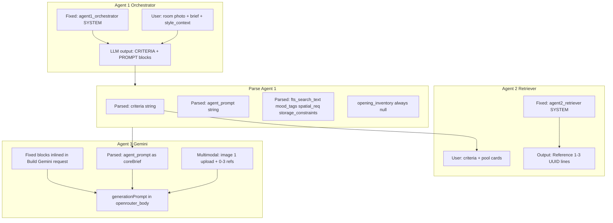

# Agent 1 → Agent 3 prompt blocks

Reference map of every **fixed** and **parsed** prompt block from Agent 1 through Agent 2 to the final Agent 3 (Gemini) text payload, as implemented in [`workflows/generate_orchestrated.json`](workflows/generate_orchestrated.json). Prompt text is baked from [`prompts/`](prompts/) via [`bake_orchestrator_prompts.py`](bake_orchestrator_prompts.py). See also [`WORKFLOW_SYSTEM.md`](WORKFLOW_SYSTEM.md) §9 (orchestrated path).



---

## Agent 1 — Orchestrator (authors text; does not generate images)

### Fixed input (system message)

| Block | Source file | Role |
|-------|-------------|------|
| **Agent 1 SYSTEM** | [`prompts/agent1_orchestrator.txt`](prompts/agent1_orchestrator.txt) + extra rules in `bake_orchestrator_prompts.py` (`AGENT1_EXTRA_RULES`) | Instructs the model to emit exactly two delimited blocks; photo-first openings policy; CRITERIA/PROMPT templates; self-check list |

**User message content (not “blocks” but inputs):**

- Room photo (base64 data URI)
- `brief`, optional `style_tag`, `room_type` / style context line

### Parsed output (`Parse Agent 1` node)

The orchestrator’s raw reply is split and normalized:

| Field | Origin | Used by |
|-------|--------|---------|
| **`criteria`** | `===CRITERIA===` … `===END===` | Agent 2 user message (full criteria text); `spatial_req` extraction |
| **`agent_prompt`** | `===PROMPT===` … `===END===` + **Parse post-processing** | Becomes Agent 3 **primary brief** (after more assembly) |

**Subsections Agent 1 is asked to write inside `===CRITERIA===`** (template in orchestrator txt):

- Spatial structure lock (openings lock, door clearance, light, storage lock, cupboard/wardrobe lines)
- User design intent (bullets)
- Style and retrieval targets
- Retrieval expansion
- Architectural lock (for retrieval)
- Room type and 3D structure notes
- Daylight and ambience target
- Style and material palette
- Functional requirements
- Agent 3 mandate (meta: PROMPT is authoritative)
- Complementarity guidance for references (1–3 roles)

**Subsections Agent 1 is asked to write inside `===PROMPT===`** (A–I outline):

- Scene identity, openings (image-1-only language), door clearance, light, 3D structure, practical layout, style/materials, camera/frame lock, quality close

**Parse Agent 1 code-derived fields** (structured, not full prose blocks):

| Field | How derived | Typical value today |
|-------|-------------|---------------------|
| `inferred_room` | From criteria + brief + room_hint | e.g. `bedroom` |
| `fts_search_text` | brief + retrieval expansion + style + room | For Supabase RPC |
| `mood_tags` | Keyword scan of criteria/brief | Up to 8 tags |
| `spatial_req` | “Spatial structure lock” section from `criteria` | `{ notes, has_doors?, has_windows? }` |
| `storage_constraints` | If brief mentions cupboard/wardrobe/closet/etc. | `{ placement, host_wall, unit_type, … }` or `null` |
| `opening_inventory` | **`parseOpeningInventory()` always returns `null`** | Openings enforced via image 1 + fixed Agent 3 blocks, not verbal wall/count text |

**Optional footers appended to `agent_prompt` during parse** (if missing from LLM text):

- Door lock footer (`DOOR_LOCK_FOOTER`)
- Window/light fidelity footer (`ARCHITECTURAL_LAYOUT_FOOTER`)
- Missing brief bullets as “User requirements (mandatory): …”
- Opening rewrite if prompt started with “empty room” / “you need to design”
- Corner-lamp placement rule when brief mentions corner lamps

Example parsed shapes: [`scripts/fixtures/agent1_dual_prompt_sample.txt`](scripts/fixtures/agent1_dual_prompt_sample.txt).

---

## Agent 2 — Retriever (picks reference IDs only)

### Fixed input

| Block | Source | Role |
|-------|--------|------|
| **Agent 2 SYSTEM** | [`prompts/agent2_retriever.txt`](prompts/agent2_retriever.txt) | How to read criteria + candidate cards; selection priority; reject rules; output format (`Reference N: <uuid> — …`) |

### Parsed / passed input (user message)

| Content | Source |
|---------|--------|
| Full **`criteria`** string | From Parse Agent 1 |
| **Candidate pool cards** | `[id=…] caption` + spatial/style metadata from `retrieve_candidates_text` RPC (+ `Check pool` filtering) |

### Output (not a generation prompt)

- Lines like `Reference 1: <uuid> — <justification>`
- Parsed to `picked_reference_ids`, `reference_count` → drives image download and `Collect image parts`

**Agent 2 does not contribute text blocks to Agent 3** — only which reference images are attached.

---

## Agent 3 — Gemini / OpenRouter (image model)

Agent 3 has **no `role: system` message**. One **`role: user`** message:

```json
{
  "content": [
    { "type": "text", "text": "<generationPrompt>" },
    { "type": "image_url", "image_url": { "url": "data:... upload" } },
    "… 0–3 reference image_url parts …"
  ]
}
```

Built in node **`Build Gemini request`**. Final string = `generationPrompt` (joined with `\n\n`).

### Fixed blocks (always inlined from prompt files / bake constants)

| Order | Block name | Source |
|-------|------------|--------|
| 1 | **ARCHITECTURAL_LOCK_BLOCK** | [`prompts/architectural_lock.txt`](prompts/architectural_lock.txt) — **HARD LOCK**, 3D shell, inpainting; defers exact pixels to CANVAS HARD LOCK |
| 2 | **CANVAS_HARD_LOCK_BLOCK** | [`prompts/image_gen_pixel_lock.txt`](prompts/image_gen_pixel_lock.txt) — WIDTH LOCK + HEIGHT/ASPECT + 3D spatial expression; `{width}`×`{height}` from `ctx.upload_b64` |
| 3 | **DOOR_CLEARANCE_BLOCK** | `DOOR_CLEARANCE_BLOCK` in bake script |
| 4 | **AGENT3_MANDATE_BLOCK** | [`prompts/agent3_generation_mandate.txt`](prompts/agent3_generation_mandate.txt) |
| 5 | **DESIGN_PRINCIPLES_BLOCK** | [`prompts/design_principles.txt`](prompts/design_principles.txt) |
| 6 | **PRIMARY_BRIEF_HEADER** | `=== PRIMARY GENERATION BRIEF (authoritative — follow this over reference images) ===` |

**Conditional fixed blocks** (included only when context matches):

| Block | Condition |
|-------|-----------|
| **OPENING_INVENTORY_BLOCK** | `ctx.opening_inventory` set — **currently never** (`parseOpeningInventory` returns `null`) |
| **WINDOW_COUNT_BLOCK** | `opening_inventory.window_count` — **currently never** |
| **SPATIAL_NOTES_BLOCK** | `spatial_req.notes` from Agent 1 criteria |
| **STORAGE_PLACEMENT_BLOCK** | `storage_constraints` with `placement !== 'none'` |
| **CUPBOARD_FOOTPRINT_BLOCK** | `storage_constraints.placement === 'freestanding_new'` |
| **refNote** | Fewer than 3 reference images attached |
| **IMAGE_GEN_CONSTRAINTS** | Prepended to `coreBrief` only if `agent_prompt` lacks frame-lock phrases **and** architectural hard lock is absent — from [`prompts/image_gen_frame_lock.txt`](prompts/image_gen_frame_lock.txt). Skipped when `architectural_lock.txt` includes HARD LOCK (default). |

### Parsed / derived block (Agent 3 primary content)

| Block | Source | Processing before insert |
|-------|--------|---------------------------|
| **`coreBrief`** | Parse Agent 1 **`agent_prompt`** | `stripPrependedConstraintBlocks()` removes duplicate OPENING/STORAGE/CANVAS/ARCHITECTURAL blocks; may append raw `brief`, `style_tag`, `room_hint` if absent; may prepend **IMAGE_GEN_CONSTRAINTS** only when hard lock is not baked at top |

**Assembly order** (architectural blocks first; primary brief last):

```
ARCHITECTURAL_LOCK_BLOCK        ← HARD LOCK + image 1 source of truth (always first)
CANVAS_HARD_LOCK_BLOCK         ← exact width/height + 3D spatial (when dimensions parse)
[OPENING_INVENTORY_BLOCK]      ← usually omitted
DOOR_CLEARANCE_BLOCK
[WINDOW_COUNT_BLOCK]           ← usually omitted
[SPATIAL_NOTES_BLOCK]          ← from parsed criteria
[STORAGE_PLACEMENT_BLOCK]      ← if brief requested storage
[CUPBOARD_FOOTPRINT_BLOCK]     ← if freestanding_new storage
AGENT3_MANDATE_BLOCK
[refNote]                      ← if < 3 refs
DESIGN_PRINCIPLES_BLOCK
PRIMARY_BRIEF_HEADER
coreBrief                      ← Agent 1 ===PROMPT=== (+ parse footers / brief append)
```

### Multimodal inputs (not text blocks)

| Image index | Content |
|-------------|---------|
| **Image 1** | User upload (authoritative geometry/light) |
| **Images 2–4** | 0–3 reference images from Agent 2 picks |

---

## Priority ladder (when instructions conflict)

From design docs and `design_principles.txt`:

1. **Image 1** (user photo) — openings, light, camera
2. **Agent 1 `===PROMPT===`** / `coreBrief` — creative brief
3. **Architectural lock + door clearance** (fixed Agent 3 blocks)
4. **Reference images** — style/material/mood only
5. Brief adjectives / retrieval criteria — must not override photo geometry

---

## Inspect a specific execution

| What you want | n8n node output field |
|---------------|------------------------|
| Agent 1 system + user request | `Build Agent 1 request` → `openrouter_body` |
| Parsed CRITERIA + PROMPT | `Parse Agent 1` → `criteria`, `agent_prompt`, `_prompt_debug` |
| Agent 2 system + pool | `Build Agent 2 request` → `openrouter_body`; `Parse Agent 2` → picks |
| **Final Agent 3 text** | `Build Gemini request` → `openrouter_body.messages[0].content[0].text` |
| OpenRouter API | `Build Gemini request` → `openrouter_body.image_config.aspect_ratio` (closest preset to upload) |
| Block flags | `Build Gemini request` → `_prompt_debug` (`has_canvas_hard_lock_block`, `has_width_lock_language`, `canvas_dims_injected`, `input_width`, `input_height`) |
| Output dimensions | `Extract output PNG` → `model_config` (`dimension_normalized`, `normalize_method` via sharp when model returns wrong size) |

From repo root (requires `N8N_API_KEY` in `.env`):

```bash
python n8n/scripts/_fetch_exec.py <execution_id>
python n8n/scripts/audit_execution.py <execution_id>
```

Writes `n8n/exec_<id>_full.json` and `n8n/audit_exec_<id>.json`.

---

## Edit (Nano Banana 2 / Gemini) — `POST /generate/edit`

Baked in [`bake_edit_prompts.py`](bake_edit_prompts.py) → node **`Build Gemini edit request`** in [`workflows/generate_edit.json`](workflows/generate_edit.json). Model: `google/gemini-3.1-flash-image-preview` from Supabase `app_config.image_model` (one user image: parent output PNG).

### Parsed from parent `generations.prompt`

| Field / block | Origin |
|---------------|--------|
| **Door / window / light locks** | `===STRUCTURE_LOCK===` if present, else `===CRITERIA===` + parent `===PROMPT===` heuristics |
| **`spatial_req.notes`** | `buildSpatialReq(parentCriteria)` → `SPATIAL_NOTES_BLOCK` |
| **`storage_constraints`** | `parseStorageConstraints(criteria, parentPrompt)` → conditional storage + cupboard blocks |
| **`window_count`** | `parseWindowCountFromCriteria` → `WINDOW_COUNT_BLOCK` |
| **`coreBrief`** | `extractPromptBlock` + `stripPrependedConstraintBlocks` on parent `===PROMPT===` |
| **Edit instruction** | Webhook `instruction`; `narrowEditInstruction()` may narrow for model payload only |

Saved row prompt (unchanged): `===STRUCTURE_LOCK===` + `EDIT (apply only this change): {user instruction}`.

### Fixed blocks (shared with Agent 3 where noted)

| Order | Block | Source |
|-------|-------|--------|
| 1 | **ARCHITECTURAL_LOCK** | [`architectural_lock.txt`](prompts/architectural_lock.txt) |
| 2 | **CANVAS_HARD_LOCK** | [`image_gen_pixel_lock.txt`](prompts/image_gen_pixel_lock.txt) + parent image dimensions (no separate FRAME_LOCK — avoids duplicate canvas rules) |
| 3 | **[WINDOW_COUNT_BLOCK]** | Parsed count from parent criteria/brief |
| 4 | **DOOR_CLEARANCE** | `DOOR_CLEARANCE_BLOCK` in [`bake_orchestrator_prompts.py`](bake_orchestrator_prompts.py) |
| 5 | **[SPATIAL_NOTES_BLOCK]** | From `spatial_req` |
| 6 | **[STORAGE / CUPBOARD]** | Same bake constants as orchestrated |
| 7 | **EDIT_PRACTICAL_FEASIBILITY** | [`edit_practical_feasibility.txt`](prompts/edit_practical_feasibility.txt) |
| 8 | **INSTANCE STRUCTURE LOCK** | Door/window/light lines from parse |
| 9 | **EDIT_NANO_BANANA_PREAMBLE** | [`edit_nano_banana_preamble.txt`](prompts/edit_nano_banana_preamble.txt) |
| 10 | **EDIT_AGENT3_MANDATE** | [`edit_agent3_mandate.txt`](prompts/edit_agent3_mandate.txt) |
| 11 | **EDIT_DESIGN_PRINCIPLES** | [`edit_design_principles.txt`](prompts/edit_design_principles.txt) |
| 12 | **FROZEN SCENE** + `coreBrief` | Parent generation brief (read-only context) |
| 13 | **[EDIT_SINGLE_ELEMENT_RULE]** | When multi-change detected — [`edit_single_element_rule.txt`](prompts/edit_single_element_rule.txt) |
| 14 | **PRIMARY EDIT** | Narrowed instruction (model only) |

### Priority ladder (edit)

1. Attached parent image (architecture, frame, pixels)
2. Structure locks + door clearance + spatial notes
3. **PRIMARY EDIT** instruction
4. Frozen scene context (do not redesign unrelated furnishings)

### Inspect an edit execution

| What you want | n8n node output |
|---------------|-----------------|
| Final Gemini text | `Build Gemini edit request` → `openrouter_body.messages[0].content[0].text` |
| Model + config | `openrouter_body.model`, `image_config.aspect_ratio`, `image_config.image_size` (`1K`) |
| Debug | `_prompt_debug` (`has_canvas_hard_lock_block`, `has_width_lock_language`, `has_frame_lock_in_prompt` should be false) |
| Output dimensions | `Extract output PNG` → sharp resize to `input_width`×`input_height` when the model returns a different canvas |

```bash
python n8n/scripts/verify_edit_prompt_pipeline.py
python n8n/bake_edit_prompts.py
```

---

## Related paths (different prompts)

- **`POST /generate/commit`** uses a simpler template prompt — not this three-agent stack.
- **Photo-only path** (empty catalog): skips Agent 2 refs but still uses Agent 1 parse + same `Build Gemini request` assembly with `reference_count = 0`.
