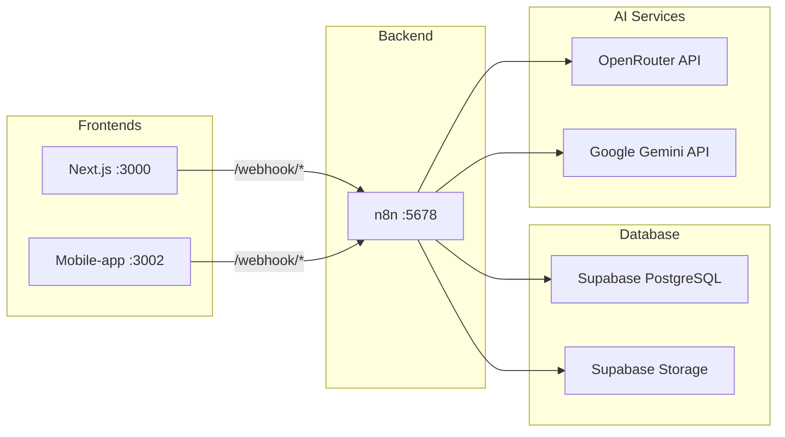
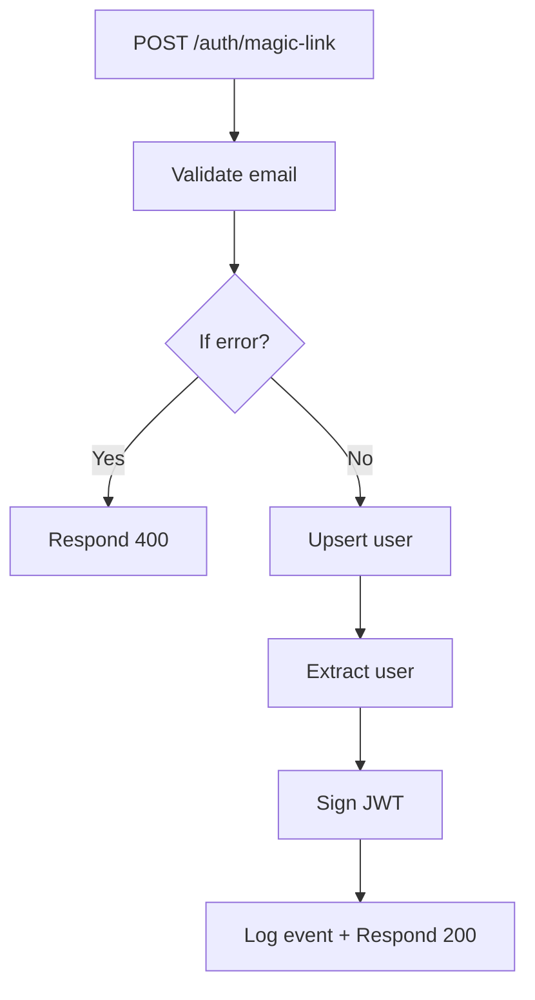
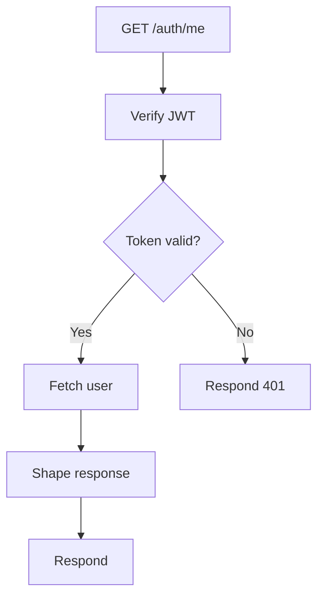
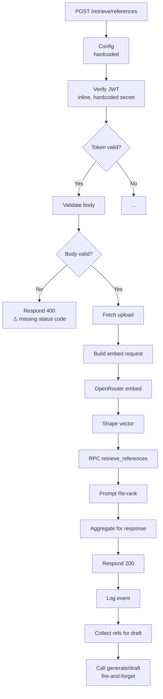
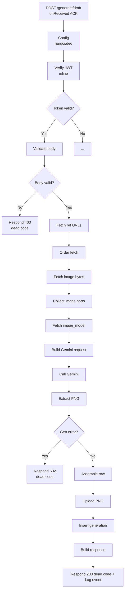
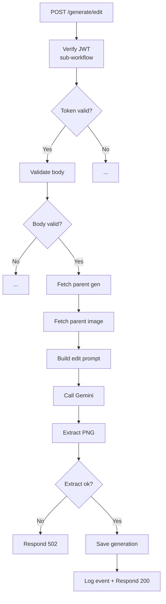
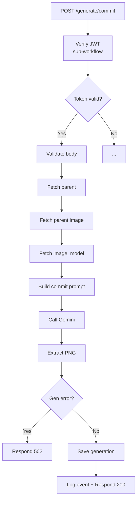
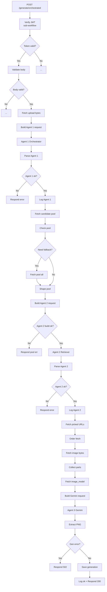

# 🐰 CodeRabbit Full Audit Report
## Interior Design RAG — Workflow, Webhook & Frontend Connectivity Audit

> **Date:** 2026-04-28  
> **Scope:** All n8n workflows, database migrations, frontend (Next.js + mobile-app), webhook routing, security  
> **Files reviewed:** 45+  
> **Findings:** 17 (3 Critical · 5 High · 6 Medium · 3 Low)

---

## Table of Contents
1. [Architecture Overview](#1-architecture-overview)
2. [Webhook Endpoint Map](#2-webhook-endpoint-map)
3. [Critical Findings](#3-critical-findings)
4. [High Severity Findings](#4-high-severity-findings)
5. [Medium Severity Findings](#5-medium-severity-findings)
6. [Low Severity Findings](#6-low-severity-findings)
7. [Workflow Logic Audit](#7-workflow-logic-audit)
8. [Frontend ↔ Backend Connectivity](#8-frontend--backend-connectivity)
9. [Database Migration Audit](#9-database-migration-audit)
10. [Summary & Recommendations](#10-summary--recommendations)

---

## 1. Architecture Overview



| Component | Port | Status |
|---|---|---|
| n8n (backend) | `:5678` | ✅ Running |
| Next.js frontend | `:3000` | ⚠️ Not confirmed running |
| Mobile-app (Atelier) | `:3002` | ✅ Running |

---

## 2. Webhook Endpoint Map

All endpoints live on `http://localhost:5678/webhook/`. The table below maps every workflow to its webhook path, HTTP method, and frontend call site.

| # | Workflow File | Webhook Path | Method | Frontend API Call | Status |
|---|---|---|---|---|---|
| 1 | `health.json` | `/health` | GET | — | ✅ OK |
| 2 | `auth_magic_link.json` | `/auth/magic-link` | POST | `api.authMagicLink()` / `WH.authMagicLink()` | ✅ Connected |
| 3 | `auth_me.json` | `/auth/me` | GET | `api.authMe()` / `WH.authMe()` | ✅ Connected |
| 4 | `uploads_room_photo.json` | `/uploads/room-photo` | POST | `api.uploadRoomPhoto()` / `WH.uploadPhoto()` | ✅ Connected |
| 5 | `retrieve_references.json` | `/retrieve/references` | POST | `api.retrieveReferences()` / `WH.retrieveRefs()` | ✅ Connected |
| 6 | `generate_draft.json` | `/generate/draft` | POST | `api.generateDraft()` / `WH.generateDraft()` | ✅ Connected |
| 7 | `generate_edit.json` | `/generate/edit` | POST | `api.generateEdit()` / `WH.generateEdit()` | ✅ Connected |
| 8 | `generate_commit.json` | `/generate/commit` | POST | `api.generateCommit()` / `WH.generateCommit()` | ✅ Connected |
| 9 | `generations_session.json` | `/generations/session/:session_id` | GET | `api.listSessionGenerations()` / `WH.listSessGens()` | ✅ Connected |
| 10 | `generations_export.json` | `/generations/:generation_id/export` | POST | `api.exportGeneration()` / `WH.exportGen()` | ✅ Connected |
| 11 | `admin_metrics.json` | `/admin/metrics` | GET | — (admin only) | ✅ OK |
| 12 | `generate_orchestrated.json` | `/generate/orchestrated` | POST | — (no frontend call) | ⚠️ Unused |

---

## 3. Critical Findings

### 🔴 C-01: Hardcoded Secrets in Workflow JSON Files

**Files:** [retrieve_references.json](file:///c:/Users/asus/OneDrive/Documents/Claude/Projects/Interior%20design%20RAG/n8n/workflows/retrieve_references.json#L29), [generate_draft.json](file:///c:/Users/asus/OneDrive/Documents/Claude/Projects/Interior%20design%20RAG/n8n/workflows/generate_draft.json#L29)

Both `retrieve_references.json` and `generate_draft.json` contain a `Config` node that **hardcodes every secret** directly into the JavaScript code:

```javascript
// Lines 29-30 of retrieve_references.json
supabase_key:    '<REDACTED_SUPABASE_SERVICE_KEY>',
gemini_key:      '<REDACTED_GEMINI_API_KEY>',
openrouter_key:  '<REDACTED_OPENROUTER_API_KEY>',
jwt_secret:      '<REDACTED_JWT_SECRET>',
admin_token:     '<REDACTED_ADMIN_TOKEN>',
```

These secrets are **also in the pinned data** and **activeVersion** blocks — meaning they're triply exposed. The same file is committed to git.

**Impact:** Full compromise of Supabase, OpenRouter, Gemini, and JWT signing if repo leaks.

> [!CAUTION]
> These secrets are committed to `.git` history. Even if removed from current files, they remain in git history forever. You should **rotate all keys immediately** and use `$env.*` references like the other workflows do.

**Remediation:**
```diff
-      supabase_key:    '<REDACTED_SUPABASE_SERVICE_KEY>',
+      supabase_key:    $env.SUPABASE_SERVICE_KEY,
-      openrouter_key:  'sk-or-v1-...',
+      openrouter_key:  $env.OPENROUTER_API_KEY,
-      jwt_secret:      '6o2iWJgH+...',
+      jwt_secret:      $env.JWT_SECRET,
```

---

### 🔴 C-02: JWT Secret Hardcoded in Inline Verify JWT Code

**Files:** `retrieve_references.json` (L42), `generate_draft.json` (L42)

These two workflows implement JWT verification **inline** (not via the shared `wf_jwt_verify` sub-workflow) and hardcode the JWT signing secret directly:

```javascript
const expected = _hmac(
  '__REDACTED_JWT_SECRET__',
  hp + '.' + pp
).toString('base64url');
```

**Impact:** If the JWT secret is rotated, these two workflows will break while all others continue working, creating authentication inconsistency.

**Remediation:** Replace inline JWT verification with the shared `wf_jwt_verify` sub-workflow call used by all other endpoints.

---

### 🔴 C-03: `.env` File Contains All Secrets and Is Not Gitignored

**File:** [.env](file:///c:/Users/asus/OneDrive/Documents/Claude/Projects/Interior%20design%20RAG/.env)

The root `.env` file contains `DATABASE_URL`, `SUPABASE_SERVICE_KEY`, `JWT_SECRET`, `N8N_API_KEY`, and all API keys. Checking the gitignore:

```
# .gitignore does list .env.local but NOT .env at root
```

**Remediation:** Add `.env` to `.gitignore` and rotate all exposed credentials.

---

## 4. High Severity Findings

### 🟠 H-01: Respond 401 Nodes Missing HTTP Status Code

**Files:** `retrieve_references.json` (L85-87), `generate_draft.json` (L85-87)

Both these workflows have `Respond 401` nodes that **do not set `responseCode`**, defaulting to `200`:

```json
{
  "respondWith": "json",
  "responseBody": "={{ JSON.stringify({ error: $json.error, code: $json.code }) }}",
  "options": {}
}
// ❌ No "responseCode": 401 set!
```

All other workflows correctly set `"responseCode": 401`. This means unauthorized requests get a `200 OK` response with an error body — the frontend won't detect the auth failure properly.

**Remediation:**
```diff
  "respondWith": "json",
+ "responseCode": 401,
  "responseBody": "={{ JSON.stringify({ error: $json.error, code: $json.code }) }}",
```

---

### 🟠 H-02: `generate_draft.json` Uses `onReceived` Response Mode — Cannot Send Final Response

**File:** [generate_draft.json](file:///c:/Users/asus/OneDrive/Documents/Claude/Projects/Interior%20design%20RAG/n8n/workflows/generate_draft.json#L14)

```json
"responseMode": "onReceived"  // Line 14
```

This means n8n sends back a `200` ACK **immediately** when the webhook receives the request. The downstream `Respond 200`, `Respond 400`, `Respond 401`, and `Respond 502` nodes **are dead code** — they will never actually send a response to the client because the response was already sent.

**Impact:** The frontend `api.generateDraft()` always gets a generic `200 {message: "Workflow was started"}` — never the actual generation result. The frontend would need to poll for results or the workflow should switch to `responseNode` mode.

> [!IMPORTANT]
> This is actually **intentional** for the fire-and-forget call from `retrieve_references → Call generate/draft` (which has a 2s timeout). However, the frontend's **direct** call to `/generate/draft` also gets this same empty ACK. If the frontend expects the generation result, this is broken.

**Remediation:** Either:
1. Change to `"responseMode": "responseNode"` if the frontend needs the result
2. Add a polling mechanism on the frontend to check generation status
3. Document that generate/draft is fire-and-forget only

---

### 🟠 H-03: `generate_orchestrated.json` Uses `$env.GEMINI_API_KEY` — Wrong Env Var Name

**File:** [generate_orchestrated.json](file:///c:/Users/asus/OneDrive/Documents/Claude/Projects/Interior%20design%20RAG/n8n/workflows/generate_orchestrated.json#L496)

```json
"value": "={{$env.GEMINI_API_KEY}}"  // Line 496
```

But in `.env` the variable is named `GOOGLE_AI_STUDIO_KEY`, not `GEMINI_API_KEY`:
```
GOOGLE_AI_STUDIO_KEY=<REDACTED_GEMINI_API_KEY>
```

Meanwhile, `generate_draft.json` correctly uses:
```json
"value": "={{$('Config').first().json._cfg.gemini_key}}"  // via hardcoded Config
```

**Impact:** The orchestrated workflow's Gemini call will fail with a missing API key error.

**Remediation:** Either rename the env var to `GEMINI_API_KEY` in `.env` or update the workflow to use `GOOGLE_AI_STUDIO_KEY`.

---

### 🟠 H-04: Inconsistent Auth Pattern — Mixed Inline vs Sub-workflow JWT Verification

| Workflow | JWT Method | Pattern |
|---|---|---|
| `auth_magic_link` | Sub-workflow `wf_jwt_sign` | ✅ |
| `auth_me` | Sub-workflow `wf_jwt_verify` | ✅ |
| `uploads_room_photo` | Sub-workflow `wf_jwt_verify` | ✅ |
| `generate_edit` | Sub-workflow `wf_jwt_verify` | ✅ |
| `generate_commit` | Sub-workflow `wf_jwt_verify` | ✅ |
| `generate_orchestrated` | Sub-workflow `wf_jwt_verify` | ✅ |
| `generations_session` | Sub-workflow `wf_jwt_verify` | ✅ |
| `generations_export` | Sub-workflow `wf_jwt_verify` | ✅ |
| **`retrieve_references`** | **Inline (hardcoded secret)** | ❌ |
| **`generate_draft`** | **Inline (hardcoded secret)** | ❌ |

**Remediation:** Refactor `retrieve_references` and `generate_draft` to use the shared `wf_jwt_verify` sub-workflow.

---

### 🟠 H-05: `Respond 400` Node in `retrieve_references` Missing Status Code

**File:** `retrieve_references.json` L142-145

```json
{
  "respondWith": "json",
  "responseBody": "={{ JSON.stringify($json._error.body) }}",
  "options": {}
}
// ❌ No responseCode — defaults to 200
```

Validation errors will return `200 OK` with an error body instead of `400`.

---

## 5. Medium Severity Findings

### 🟡 M-01: `auth_me.json` — If Branch Direction Inverted

**File:** [auth_me.json](file:///c:/Users/asus/OneDrive/Documents/Claude/Projects/Interior%20design%20RAG/n8n/workflows/auth_me.json#L117-L121)

```json
"Token valid?": {
  "main": [
    [{ "node": "Fetch user",  "type": "main", "index": 0 }],  // TRUE branch → Fetch user
    [{ "node": "Respond 401", "type": "main", "index": 0 }]   // FALSE branch → 401
  ]
}
```

This routes TRUE → happy path and FALSE → 401. **This is correct.** However, every other workflow does it the opposite way — TRUE goes to error response. This inconsistency makes debugging harder. The `If` node in n8n v2 routes `output 0 = TRUE`, `output 1 = FALSE`.

**Issue:** In `auth_magic_link`, `uploads_room_photo`, `retrieve_references`, and all `generate_*` workflows, the condition checks for the **error** object existing (true = error → respond error). But `auth_me` checks `ok === true` (true = success → fetch user). The logic is correct but the patterns are confusingly mixed.

---

### 🟡 M-02: `generate_orchestrated.json` — Missing Frontend Integration

The orchestrated workflow is marked `"active": false` and **no frontend call exists** for it in either `api.ts` or `mobile-app/index.html`. The endpoint `POST /generate/orchestrated` is fully implemented but unreachable from the UI.

**Remediation:** Either wire it into the frontend or document it as a future/API-only feature.

---

### 🟡 M-03: `generate_orchestrated.json` — Uses `$env.*` While Draft/Retrieve Use Hardcoded Config

The orchestrated workflow correctly uses `$env.SUPABASE_URL`, `$env.SUPABASE_SERVICE_KEY`, `$env.OPENROUTER_API_KEY` etc. But the draft and retrieve workflows use the inline `Config` node with hardcoded values. This means env var changes affect some workflows but not others.

---

### 🟡 M-04: Mobile App Has No Backend URL Configuration UI

The mobile app defaults to `http://localhost:5678/webhook` and allows override via `localStorage.setItem('atelier:api', ...)` but provides no UI to change this. This will break when deploying to any non-local environment.

---

### 🟡 M-05: RPC `retrieve_references` Function Signature Has 5 Params But Workflow Sends Them As Named JSON

**File:** [011_retrieve_references_fuzzy_and_tiered.sql](file:///c:/Users/asus/OneDrive/Documents/Claude/Projects/Interior%20design%20RAG/n8n/migrations/011_retrieve_references_fuzzy_and_tiered.sql#L12-L17)

```sql
CREATE FUNCTION retrieve_references(
    q          TEXT,
    room_type  TEXT,
    style_tag  TEXT,
    k          INTEGER,
    prompt     TEXT DEFAULT NULL
)
```

The workflow sends via PostgREST RPC:
```json
{ "q": "...", "room_type": "...", "style_tag": "...", "k": 5, "prompt": "..." }
```

This matches correctly. ✅ However, the `q` parameter is passed as `$json.embedding_literal` which is the vector literal string `[0.1,0.2,...]`. Inside the SQL, it's cast via `q::vector`. This works but the parameter name `q` is misleading for a vector.

---

### 🟡 M-06: API Spec Doc Base URL Mismatch

**File:** [api-spec.md](file:///c:/Users/asus/OneDrive/Documents/Claude/Projects/Interior%20design%20RAG/contracts/api-spec.md#L3)

```markdown
**Base URL (dev):** `http://localhost:8000`
```

The actual backend is at `http://localhost:5678/webhook`. The spec references a FastAPI backend at port 8000 that doesn't exist. The spec mentions FastAPI, Pydantic, and `backend/generation/base.py` — none of which exist. The doc is stale from an earlier architecture.

---

## 6. Low Severity Findings

### 🟢 L-01: Duplicate Workflow Content in `retrieve_references.json`

The file contains both the workflow definition (L1-628) AND a full `activeVersion` copy (L702-end) with identical node definitions. This doubles the file size to 56KB. The `activeVersion` block is n8n metadata and can be trimmed from the version-controlled copy.

---

### 🟢 L-02: `wf_upload.json` — Large Unused Workflow (183KB)

The `wf_upload.json` file is 183KB and appears to be an older consolidated upload workflow. It's not referenced by any frontend or other workflow.

---

### 🟢 L-03: Execution Debug Files Committed

Files `exec15.json`, `exec_174.json`, `exec_174_full.json`, `exec_latest.json` are execution logs/debug artifacts that shouldn't be in version control.

---

## 7. Workflow Logic Audit

### Flow Sequence Verification

#### ✅ Auth Magic Link Flow

**Verdict:** Correct. All connections verified.

#### ✅ Auth Me Flow

**Verdict:** Correct.

#### ⚠️ Retrieve References Flow

**Issues found:**
1. Config node hardcodes secrets (C-01)
2. JWT verify is inline with hardcoded secret (C-02)
3. Respond 401 missing status code (H-01)
4. Respond 400 missing status code (H-05)

#### ⚠️ Generate Draft Flow

**Issues found:**
1. All Respond nodes are dead code due to `onReceived` mode (H-02)
2. Config hardcodes secrets (C-01)
3. Respond 401 missing status code (H-01)

#### ✅ Generate Edit Flow

**Verdict:** Correct. Uses proper sub-workflow pattern.

#### ✅ Generate Commit Flow

**Verdict:** Correct.

#### ⚠️ Generate Orchestrated Flow

**Issues found:**
1. Uses `$env.GEMINI_API_KEY` which doesn't exist in `.env` (H-03)
2. Not connected to any frontend (M-02)

---

## 8. Frontend ↔ Backend Connectivity

### Next.js Frontend ([frontend/src/lib/api.ts](file:///c:/Users/asus/OneDrive/Documents/Claude/Projects/Interior%20design%20RAG/frontend/src/lib/api.ts))

| Frontend Method | Backend Path | Match? |
|---|---|---|
| `api.authMagicLink()` | `POST /auth/magic-link` | ✅ |
| `api.authMe()` | `GET /auth/me` | ✅ |
| `api.uploadRoomPhoto()` | `POST /uploads/room-photo` | ✅ |
| `api.retrieveReferences()` | `POST /retrieve/references` | ✅ |
| `api.generateDraft()` | `POST /generate/draft` | ⚠️ Returns empty ACK |
| `api.generateEdit()` | `POST /generate/edit` | ✅ |
| `api.generateCommit()` | `POST /generate/commit` | ✅ |
| `api.listSessionGenerations()` | `GET /generations/session/:id` | ✅ |
| `api.exportGeneration()` | `POST /generations/:id/export` | ✅ |
| `api.listUserSessions()` | — | ⚠️ Mock/stub |
| `api.listNotifications()` | — | ⚠️ Mock/stub |
| `api.topUpCredits()` | — | ⚠️ Mock/stub |

**Base URL:** `NEXT_PUBLIC_BACKEND_URL=http://localhost:5678/webhook` ✅ Correct

### Mobile App ([mobile-app/index.html](file:///c:/Users/asus/OneDrive/Documents/Claude/Projects/Interior%20design%20RAG/mobile-app/index.html))

| Mobile Method | Backend Path | Match? |
|---|---|---|
| `WH.authMagicLink()` | `POST /auth/magic-link` | ✅ |
| `WH.authMe()` | `GET /auth/me` | ✅ |
| `WH.uploadPhoto()` | `POST /uploads/room-photo` | ✅ |
| `WH.retrieveRefs()` | `POST /retrieve/references` | ✅ |
| `WH.generateDraft()` | `POST /generate/draft` | ⚠️ Returns empty ACK |
| `WH.generateEdit()` | `POST /generate/edit` | ✅ |
| `WH.generateCommit()` | `POST /generate/commit` | ✅ |
| `WH.listSessGens()` | `GET /generations/session/:id` | ✅ |
| `WH.exportGen()` | `POST /generations/:id/export` | ✅ |

**Base URL:** `localStorage default = http://localhost:5678/webhook` ✅ Correct

---

## 9. Database Migration Audit

| Migration | Purpose | Status |
|---|---|---|
| `004_nemotron_embeddings.sql` | Create `reference_embeddings` table | ✅ |
| `005_app_config.sql` | Create `app_config` key-value store | ✅ |
| `006_storage_buckets.sql` | Create storage buckets | ✅ |
| `007_retrieval_rpc.sql` | Initial `retrieve_references` RPC | ⚠️ Superseded |
| `008_admin_metrics_rpc.sql` | Admin metrics RPC | ✅ |
| `009_retrieve_references_tiered_fallback.sql` | Tiered fallback for retrieval | ⚠️ Superseded |
| `010_retrieve_references_fix_param_names.sql` | Fix parameter names | ⚠️ Superseded |
| `011_retrieve_references_fuzzy_and_tiered.sql` | Final fuzzy + tiered retrieval | ✅ Active |

> [!NOTE]
> Migrations 007, 009, and 010 are all superseded by 011. They should still be kept for migration history integrity, but the active function definition is in 011.

The current `retrieve_references` function signature:
```sql
retrieve_references(q TEXT, room_type TEXT, style_tag TEXT, k INTEGER, prompt TEXT DEFAULT NULL)
```
This matches what the n8n workflow sends. ✅

---

## 10. Summary & Recommendations

### Priority Actions

| Priority | Finding | Action |
|---|---|---|
| 🔴 **NOW** | C-01, C-02, C-03: Hardcoded secrets | Rotate ALL keys, refactor Config nodes to use `$env.*`, add `.env` to gitignore |
| 🔴 **NOW** | H-01, H-05: Missing 401/400 status codes | Add `responseCode` to Respond nodes in `retrieve_references` and `generate_draft` |
| 🟠 **This week** | H-02: `generate_draft` onReceived mode | Decide: switch to `responseNode` or add polling |
| 🟠 **This week** | H-03: Wrong env var `GEMINI_API_KEY` | Fix to `GOOGLE_AI_STUDIO_KEY` or add alias |
| 🟠 **This week** | H-04: Inline JWT verify | Refactor to use shared `wf_jwt_verify` |
| 🟡 **Next sprint** | M-02: Wire orchestrated flow to frontend | Add UI or document as API-only |
| 🟡 **Next sprint** | M-06: Update stale API spec | Rewrite `contracts/api-spec.md` for n8n architecture |

### Architecture Health Score

| Area | Score | Notes |
|---|---|---|
| Webhook routing | **9/10** | All paths properly mapped |
| Frontend connectivity | **8/10** | All endpoints connected, draft returns empty ACK |
| Workflow logic | **7/10** | Correct flows, but 2 workflows use antipatterns |
| Security | **3/10** | Hardcoded secrets in git, missing status codes |
| Code consistency | **5/10** | Mixed inline vs sub-workflow JWT, mixed env vs hardcoded config |
| Database migrations | **9/10** | Clean evolution, final state correct |

### Overall: **6.8/10** — Functional but needs security hardening and consistency refactoring.
